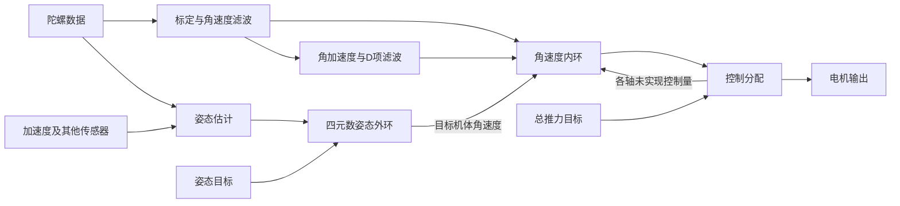

# PX4 源码解析与 self_flight 后续框架

日期：2026-10-06。参考固定为 PX4-Autopilot **v1.17.0**，不随 main 自动变化。

此前只查过官方控制框图；本轮实际读了下面列出的关键算法及调用路径。姿态控制、角速度 PID、顺序去饱和分配算法读了完整函数；传感器服务、EKF2、DShot 只审阅相关输入输出和调度路径。没有审计整个 PX4，没有完整解析 EKF 数学，也没有读取其 H743 定时器/DMA底层。通过在线官方源码读取；本机直接下载失败，没有得到一份本地 PX4 checkout。

本轮交付是分析和接口草案。`control-framework.hpp` 只有原创声明，位于 docs，不加入 CMake，不改变当前固件，也不代表 PID、混控或解锁已经实现。

## 1. 实际读取的源码

所有链接固定在 v1.17.0，行号指源码行而非浏览器页面行。

| 文件 / 阅读入口 | 作用与本轮范围 |
|---|---|
| [AttitudeControl.cpp](https://github.com/PX4/PX4-Autopilot/blob/v1.17.0/src/modules/mc_att_control/AttitudeControl/AttitudeControl.cpp) | `setProportionalGain`、`update`：完整姿态外环算法 |
| [mc_att_control_main.cpp](https://github.com/PX4/PX4-Autopilot/blob/v1.17.0/src/modules/mc_att_control/mc_att_control_main.cpp) | `Run` 中目标更新、估计器重置处理、外环调用 |
| [rate_control.cpp](https://github.com/PX4/PX4-Autopilot/blob/v1.17.0/src/lib/rate_control/rate_control.cpp) | `update`、`updateIntegral`：完整角速度控制计算 |
| [MulticopterRateControl.cpp](https://github.com/PX4/PX4-Autopilot/blob/v1.17.0/src/modules/mc_rate_control/MulticopterRateControl.cpp) | `Run`：采样时刻、角速度/角加速度输入、积分重置、分配反馈 |
| [VehicleAngularVelocity.cpp](https://github.com/PX4/PX4-Autopilot/blob/v1.17.0/src/modules/sensors/vehicle_angular_velocity/VehicleAngularVelocity.cpp) | 滤波设置及 `Run`：独立快速角速度通路、差分和 D 项滤波 |
| [VehicleIMU.cpp](https://github.com/PX4/PX4-Autopilot/blob/v1.17.0/src/modules/sensors/vehicle_imu/VehicleIMU.cpp) | `Run`、`Publish`：采样排队、增量积分、时间及状态发布 |
| [attitude_estimator_q_main.cpp](https://github.com/PX4/PX4-Autopilot/blob/v1.17.0/src/modules/attitude_estimator_q/attitude_estimator_q_main.cpp) | `init`、`update`、姿态发布：互补四元数估计器，供 Mahony 对照 |
| [EKF2.cpp](https://github.com/PX4/PX4-Autopilot/blob/v1.17.0/src/modules/ekf2/EKF2.cpp) | IMU 输入与 `PublishAttitude`：接口和重置元数据，不是完整 EKF 推导 |
| [ControlAllocator.cpp](https://github.com/PX4/PX4-Autopilot/blob/v1.17.0/src/modules/control_allocator/ControlAllocator.cpp) | 分配及 `publish_control_allocator_status`：执行器限制、未实现控制量反馈 |
| [ControlAllocationSequentialDesaturation.cpp](https://github.com/PX4/PX4-Autopilot/blob/v1.17.0/src/lib/control_allocation/control_allocation/ControlAllocationSequentialDesaturation.cpp) | 顺序去饱和及各 airmode 策略 |
| [DShot.cpp](https://github.com/PX4/PX4-Autopilot/blob/v1.17.0/src/drivers/dshot/DShot.cpp) | `updateOutputs`：停止值、四路准备后统一触发；不包含本板 DMA 实现 |

## 2. PX4 的控制链应该怎么理解



### 2.1 姿态估计不等于姿态控制

`attitude_estimator_q` 是互补四元数估计器，适合比较你的六轴 Mahony。它有加速度模长门限和低转速零偏学习；带速度信息时还可以补偿运动加速度。EKF2 是另一条更完整的状态估计路径，不能把这个互补估计器称作 EKF2。[互补估计源码](https://github.com/PX4/PX4-Autopilot/blob/v1.17.0/src/modules/attitude_estimator_q/attitude_estimator_q_main.cpp)

你的模长可信度、独立加计时间戳、启动静止标定和残余零偏限制已经具备合理基础。暂时保留 Mahony。仅凭六轴 IMU 无法获得绝对航向，也不能可靠区分所有重力与平移加速度；加速度模长接近 g 并不一定代表飞机没有加速。后续有速度/位置传感器再处理这些可观测性问题。

### 2.2 姿态外环：四元数误差输出角速度

PX4 的姿态环用当前/目标四元数求误差，选择最短旋转的符号，再转换成三轴目标角速度。其算法还先处理推力方向，再加权混入偏航，最后叠加偏航前馈并限幅。这比三个独立 Euler 角做差更适合跨竖直姿态。[姿态算法](https://github.com/PX4/PX4-Autopilot/blob/v1.17.0/src/modules/mc_att_control/AttitudeControl/AttitudeControl.cpp)

对 self_flight 的最简首版，先验证下面的完整四元数 P 外环：

```text
q_error = conjugate(q_current) * q_target
e = 2 * vector_part(canonical(q_error))
rate_target = axis_limit(K_attitude * e + body_rate_feedforward)
```

这里 `canonical` 必须保证 q 与 -q 输出相同；恰好 180° 还要规定一致的符号选择。所有输入先检查有效性、归一化、时间和参考段。这只是第一阶段方案，**降低 yaw 增益不等于实现 PX4 的推力方向优先算法**；需要大角度能力时再补相应策略。

界面保持 `(Roll, Pitch, total_yaw)`，内部控制用 `q_nb`。摇杆输入的 roll/pitch 倾角可以用来生成目标四元数。`total_yaw` 用于观察连续航向；普通航向保持使用同一参考段的相对目标，不把圈数直接当无界误差。首个模式也可以让 yaw 摇杆直接指定偏航角速度。

### 2.3 角速度内环：P/I 跟踪，D 抑制测量变化

PX4 的核心形式是：

```text
error = rate_target - measured_rate
control = Kp * error + integral - Kd * measured_angular_acceleration
          + Kff * rate_target
```

D 使用测量角加速度，避免目标阶跃直接造成微分尖峰。积分结合各轴正负饱和方向处理，未解锁/落地状态另行重置或停止积累。[PID 算法](https://github.com/PX4/PX4-Autopilot/blob/v1.17.0/src/lib/rate_control/rate_control.cpp)

首版实现 P/I/D、积分上限、方向性抗饱和和重置即可；前馈、非线性积分衰减稍后按测试需要加。输出先定义为归一化控制量，不冒充已经辨识的 N·m，也不直接照抄 PX4 参数。

### 2.4 快速角速度反馈应与姿态估计分工

PX4 的快速角速度通路独立于 EKF：先滤角速度，再差分，并对角加速度继续滤波。输出角速度扣除在线偏置，而角加速度不直接差分在线偏置跳变；其实现还按配置支持陷波。[角速度处理](https://github.com/PX4/PX4-Autopilot/blob/v1.17.0/src/modules/sensors/vehicle_angular_velocity/VehicleAngularVelocity.cpp)

你的 `Mahony::update` 目前同时完成 gyro 低通和姿态解算，`body_rate_rad_s` 已正确排除人为重力反馈。增加内环时，建议抽出唯一一次 gyro 处理：

```text
六面/启动标定 + 安装变换 → 标定后机体 gyro
                       → gyro 低通 → 角速度减残余偏置 → 内环 P/I
                                  → 差分 + D 低通 → 内环 D
                                  → Mahony 四元数传播
```

第一帧或断流后差分状态重新初始化，D 反馈未准备好，不能拿零时间间隔计算。Mahony 接收已滤 gyro 后，关闭/移除它内部相同滤波，避免双重相位延迟。滤波截止频率由实测噪声、机械振动和闭环响应决定；暂不加入没有 RPM 或频谱证据的多级陷波。

### 2.5 混控必须把饱和反馈给内环

PX4 分配器限制执行器，并报告请求控制量与实际分配量之差；去饱和策略还考虑推力、横滚俯仰与偏航的优先级。[分配状态](https://github.com/PX4/PX4-Autopilot/blob/v1.17.0/src/modules/control_allocator/ControlAllocator.cpp)、[去饱和算法](https://github.com/PX4/PX4-Autopilot/blob/v1.17.0/src/lib/control_allocation/control_allocation/ControlAllocationSequentialDesaturation.cpp)

你目前只有 `ActuatorCommand::saturated[4]`，表示电机是否到边界，不能直接得出哪一个控制轴的积分应该停止。首版四旋翼混控还需要 `unallocated_effort` 和三轴正/负限制反馈：实际无法继续增加 roll 时停止该方向积分，允许反向积分退出饱和。反馈使用上一周期，并检查时效；过旧则不继续积分。

实际 M1～M4 所在机臂、桨向和电机转向尚未确认，不能预填混控符号。混控配置初始化时检查矩阵，并准备反算实际实现量所需的映射；循环中避免重复求逆。

## 3. 直接对照当前 self_flight

| 当前位置 / 事实 | 优化建议 | 优先级与判断 |
|---|---|---|
| `flight/core/src/attitude.cpp`：gyro 低通嵌在 Mahony 内 | 抽成共享 RateFeedback；补角加速度差分及独立 D 低通；保持校正角速度不包含重力反馈 | P3+，内环前完成 |
| `flight/core/include/self_flight/core/data.hpp`：ControlSetpoint 尚无目标四元数 | 实现姿态外环时把姿态目标明确为 q_nb，并记录参考 epoch；更新现有契约，不长期维护两套生产类型 | P5；现在只给草案 |
| `total_epoch` 已能标记估计重新对齐，但没有控制器处理 | 首版 Armed 时发现参考改变就锁存故障、停止输出、清积分；Disarmed 可重新建立目标。连续重基准需额外 delta_q，后续再做 | P4 必须接入 |
| `flight/services/imu.cpp` 与 `attitude.cpp`：事件通知 + 最新样本交接 | 增加完整控制链后测量合并事件、序号缺口与最长延迟。若有消费丢帧，已捕获帧可用短固定队列；若寄存器读前已覆盖，再考虑传感器 FIFO | P4前基线，P5负载复测；不能用软件队列恢复未读数据 |
| `platform/stm32h7/platform.cpp`：阻塞 SPI 超时 2ms，gyro 周期约1ms | 正常读取此前实测很快，但失败超时可能越过周期；补故障注入、截止时间与输出故障处理，再决定是否缩短超时或转 DMA | P4/P5；这是失败路径风险，不是已复现丢样 |
| `ActuatorCommand::saturated[4]`，没有各轴分配反馈 | 补请求减已实现的归一化控制量及三轴正负饱和，接入积分抑制 | P5 内环+混控一起完成 |
| q 在 propagate 后又归一化；total_yaw 约1kHz求 atan2 | 先测运行时间。确认多余归一化路径后可合并检查；若确实占预算，再独立降低显示派生量频率 | 低优先级；不取消有限性和单位四元数检查 |
| 已有 Boot/Calibrating/Disarmed/Armed/Fault 数据枚举 | 实现实际转换、明确解锁边沿、低油门、RC失联、IMU失效及驱动停止帧；不能把枚举当功能完成 | P4 核心工作 |

已有设计应保留：core/platform 分层、FRD/NED及 SI、实际采样时间、有限性检查、启动运动拒绝、安装变换、独立加计新样本、日志不阻塞快速线程、缺样计数。PX4 角速度服务对 dt 有约束处理，你的工程规则要求拒绝倒退/过大间隔；这里继续遵守本工程规则，不照搬其时间钳位。[PX4 内环调用](https://github.com/PX4/PX4-Autopilot/blob/v1.17.0/src/modules/mc_rate_control/MulticopterRateControl.cpp)

PX4 对估计重置携带旋转变化并调整目标；你的段号只有“参考改变”的信息，因此首版故障锁存比假装保持旧航向更清楚。[外环重置处理](https://github.com/PX4/PX4-Autopilot/blob/v1.17.0/src/modules/mc_att_control/mc_att_control_main.cpp)、[EKF 姿态发布](https://github.com/PX4/PX4-Autopilot/blob/v1.17.0/src/modules/ekf2/EKF2.cpp)

## 4. 最简工程框架

下面是计划中的文件归属，不是已经新增的生产源码。每个 core 模块提供直接的固定状态函数/类；没有消息总线、工厂、运行时注册或动态分配。

```text
flight/core/
  attitude.hpp/.cpp       现有 Mahony、四元数工具
  rate_feedback.hpp/.cpp gyro低通、角加速度、D低通
  control.hpp/.cpp        四元数外环 + 三轴角速度PID
  mixer.hpp/.cpp          固定四路混控、去饱和、轴反馈
  flight_guard.hpp/.cpp   解锁、失联/健康检查、故障锁存
drivers/
  bmi088.hpp/.cpp         现有器件协议
  rc_<actual>.hpp/.cpp    只实现实际接收机的一种协议
  dshot.hpp/.cpp          帧编码/校验，不含HAL
flight/services/
  imu.cpp                继续独占SPI与启动标定
  attitude.cpp           逐步扩展成快速控制编排，保留一个gyro驱动任务
  rc.cpp                 接收机帧与时间检查
  log.cpp                低优先级日志
platform/stm32h7/
  platform.cpp           SPI、时间、UART、定时器DMA、缓存处理
board/                   真实IOC、四路引脚/时钟/电机映射
tools/attitude-viewer.html 页面仍显示Roll/Pitch/total_yaw，模型用q
```

快速循环建议由 gyro 事件驱动，初始目标约 1kHz，与现有采样对齐。先在同一快速任务里顺序执行 rate 处理、Mahony、状态机、外环/内环、混控和输出提交，减少快任务之间的再次排队。初版外环也可同频以减少分频逻辑；只有测量显示需要时，再降至约250Hz。频率是本项目设计目标，不是 PX4 所有机型的固定配置。

RC 目标更新可以更慢，但快速环每次检查其新鲜度。Rate 模式直接生成机体角速度目标；Attitude 模式先生成姿态目标，再由外环生成角速度。内环所用当前 rate 不等待欧拉角转换。状态机每周期拥有最终输出许可，DShot驱动另外检查许可/时效并能发停止帧。

`docs/control-framework.hpp` 给出关键接口草案。它复用现有数学、时间和数据契约；默认无效、默认禁止输出。只作设计审阅，后续选定功能时再迁移进 core，并更新现有 ControlSetpoint，避免草案成为第二套常驻接口。

## 5. 后续顺序与验收

### P3+：为控制准备数据通路

1. 抽出唯一的 gyro 低通，新增角加速度和 D 低通；为断流/首帧定义恢复规则。
2. 定义 rate、姿态目标、控制请求、轴饱和反馈以及参考重置处理；保持 HTML 显示选择。
3. 在没有电机输出的条件下测完整快速链：测量时间→提交时间、最坏耗时、丢样与截止时间错误；重新测当前新增 yaw 派生量的真实开销。

验收：实际不等间隔、重复/倒退/缺样；零偏更新不产生虚假微分；静止 D 噪声和延迟可量化。此前旧 P3 的 maxrun=180us/maxlat=282us只是旧固件观测，不能代替当前版本或加入控制后的测量。

### P4A：可离线验证的输出和状态逻辑

实现 DShot300 帧编码、停止值和固定四路提交契约；状态机完成启动、标定、解锁边沿、低油门、RC失联、估计重置/失效及故障恢复。根据实际接收机选一种解析协议。先以假输出记录验证所有状态，不输出电机信号。

验收：校验与边界帧、错误/过期 RC、失联、急停、拒绝带油门解锁、故障后不自动重新解锁。未知接收机协议不凭空选定。

### P4B：本板四路 DShot300

依据真实 IOC 配置定时器/DMA、四通道同步、缓冲区寿命和 H7 cache；逻辑分析仪检查位宽、周期、通道顺序及停止帧，再做拆桨电调测试。PX4 高层驱动的参考点是四路准备后统一触发，而本板底层仍需原创实现和实测。[DShot 输出路径](https://github.com/PX4/PX4-Autopilot/blob/v1.17.0/src/drivers/dshot/DShot.cpp)

验收：启动/未解锁/失联/停止更新时输出行为明确；映射实际电气 M1～M4 与机臂、电机转向。DShot300单 bit约3.33us、16bit约53.3us是协议计算值，不能写成示波器测量值。

### P5A：角速度闭环与固定四路混控

先实现角速度 P/I/D、D测量滤波、积分限制及方向性抗饱和，再接固定机架混控。参数先在主机合成模型、实机无输出日志和回放中检查，不能从 PX4 默认增益直接推定本机可飞。

验收：目标阶跃无D微分尖峰、正负饱和允许反向退积分、实际dt、输出限幅、异常时状态不发布；记录每轴误差、P/I/D、请求/已实现控制量和四路输出。然后才做拆桨方向检查及受约束单轴测试。

### P5B：姿态外环与自稳模式

实现四元数误差 P、角速度限制和目标参考处理。小倾角目标先验收；覆盖q/-q、90°附近、180°符号约定、估计重置和模式切换。需要大角度飞行时，再加入推力方向优先与独立 yaw 权重。

验收：页面 Euler 换支不影响内部控制；目标平滑、模式转换不突加积分或旧航向目标。纯六轴方案仍以相对航向为边界。

### P5C/P6：台架再到扩展估计

受约束闭环验证后，才进入真实机架调参和分阶段飞行验收。记录负载下的时序与振动；有证据再选硬件 FIFO、SPI DMA、二阶滤波/陷波。之后按需要增加气压计、光流、参数持久化，以及带外部观测的 EKF。双 IMU、双向 DShot/RPM、通用分配器和复杂地面站不作为首飞前置条件。

**建议下一个实施包是 P3+ 加 P4A；P4B需要实际接收机、四电机映射及测量条件。** 框架审阅不依赖这些信息；本轮没有实施控制、改IOC、烧录或输出电机信号。

## 6. 本轮验证

接口草案通过 MinGW 主机与 Cortex-M7 ARM 编译器的 C++17 语法检查，开启 `-Wall -Wextra -Wpedantic -Werror`。检查复用头文件可包含、类型声明可编译和默认输出许可为 false；没有算法实现可供运行测试，也没有重新链接固件。生产源码与 CMake 不变。
